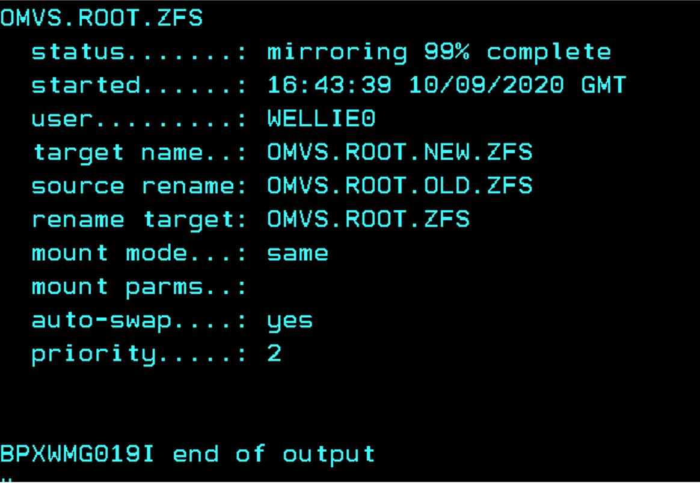

The BPXWMIGF command can now be used to non-disruptively manage your zFS file systems, which means 
you no longer have to unmount them.

To enable administrators to migrate HFS file systems to zFS, z/OS® UNIX® System Services introduced 
the BPXWMIGF command in z/OS V2R3. The file system migration occurs in place without affecting any 
actively running workloads. In z/OS V2R4, BPXWMIGF was extended to support zFS to zFS migrations.

With the enhancements to BPXWMIGF in V2R4 to support zFS source file systems, 
you now have an easier way to manage your zFS file systems. You can allocate and 
use a new zFS file system data set without disruptions. You do not have to unmount 
your zFS file system when you move from one volume to another, make the file system 
bigger or change the key label of an encrypted file system.

BPXWMIGF copies all of the data from your source (old) file system to your target (new) file 
system, including access control lists (ACLs). It also maintains the same file identifiers 
(FIDs) for each node. BPXWMIGF is designed to work without affecting any running workloads. 
Any write type I/O that is occurring on the old file system is mirrored to the new file system 
to keep the two in sync. When the file system copy is complete, the new file system is swapped 
in place of the old file system without requiring an unmount. During this swap operation, 
all activity on the source file system is halted so that the source file system can be 
unmounted and the target file system mounted in its place. Any active operation on nodes 
within the file system will continue as though nothing had changed.

Let's take a look at a few examples.

```
bpxwmigf -*source* omvs.root.zfs -*target* omvs.root.new.zfs
```

## Output 1


In this example, OMVS.ROOT.ZFS is the source file system that will be migrated to 
target OMVS.ROOT.NEW.ZFS. By default, the swap will not occur once the copy is complete. 
To initiate the swap processing, you must use the -swap option. You have two choices when 
using the -swap option. You can use it on the original invocation of the BPXWMIGF command. 
Or, if you want to wait until later to initiate the swap, you can invoke the command again 
with the -swap option. During a migration, the mount mode and mount parameters are retained 
after the swap. If you want to automatically retain the same mount parameters, APAR OA58586 is 
required.

Let's say in our previous example that your source is mounted read/write and after you 
initiated the migration you decided that you would prefer to switch the mount mode to 
read-only after the migration is completed.

`bpxwmigf -*source* omvs.root.zfs -*mode* ro -*swap*`

## Output 2


BPXWMIGF is invoked again with the change in mount mode and we also decided to initiate the swap. 
You might think that you will have to update your BPXPRMxx parmlib member (or wherever else you 
reference the file system name) with the new name, but you don’t because BPXWMIGF has you covered 
there. You have options that allow you to rename the source and rename the target to the old source 
name or to just individually rename the source or target. 

`bpxwmigf -*source* omvs.root.zfs -*target* omvs.root.new.zfs -*swap* -*srename* omvs.root.old.zfs -*trename*`

## Output 3



In the previous example, the source was renamed to OMVS.ROOT.OLD.ZFS and the target was 
renamed to the source's previous name, OMVS.ROOT.ZFS. Notice that the -swap option was used 
there. After all the data is copied, the swap starts and the file system data sets are renamed. 
All you had to do was use one single command to accomplish the renaming. No other changes were 
needed.

In order to keep track of everything, you can use the BPXWMIGF command to query the migrations. 
You can query a specific migration or all migrations, and you can filter by status (active/success/failed).

`bpxwmigf -*query* omvs.root.zfs`

## Output 4


Instead of specifying the -source option, you specify -query followed by the source file system. 
If you started a migration by mistake or decided that your target needed to be allocated with a 
different option, you can cancel the migration. Similar to querying, instead of using the 
-source option, you specify the -cancel option with just the source file system's name specified.

`bpxwmigf -*cancel* omvs.root.zfs`

## Output 5


Before you start a migration, be aware of these usage notes:

- A move or unmount of the file system being migrated will cause the migration to be canceled.
- The target file system must be newly formatted. You cannot restart a failed or canceled migration. Instead, you must reformat the target and start the migration again.
- zFS to zFS migrations are supported in V2R4 and later. Previous releases cannot be in the SYSBPX sysplex group during the migration.
- Support for source file systems mounted as RWSHARE was provided via APAR OA57021.

Other options are available for the BPXWMIGF command, including the capability to set the speed at which the migration processing copies data (using the -priority option).

[Learn more about the BPXWMIGF command.](https://www.ibm.com/docs/en/zos/2.4.0?topic=descriptions-bpxwmigf-migrate-hfs-zfs-file-systems-zfs)

## About the author

Daniel Acevedo is the z/OS UNIX File Systems product owner.