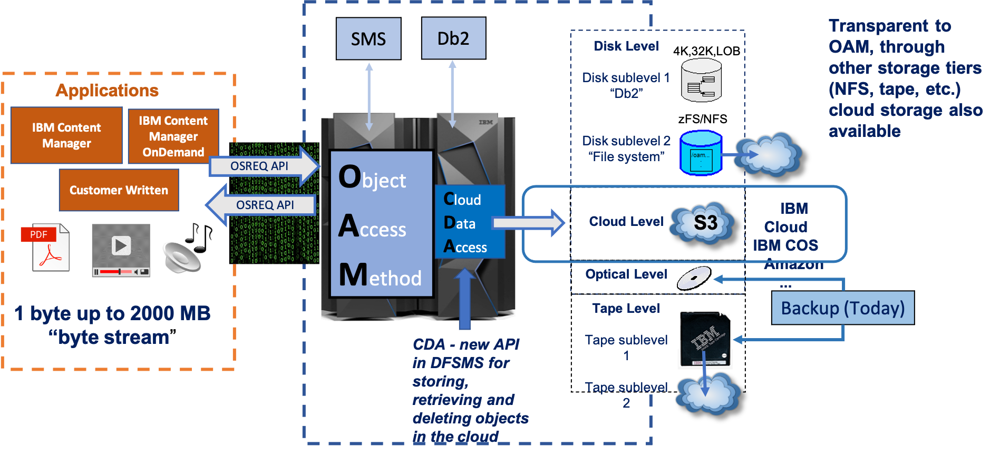
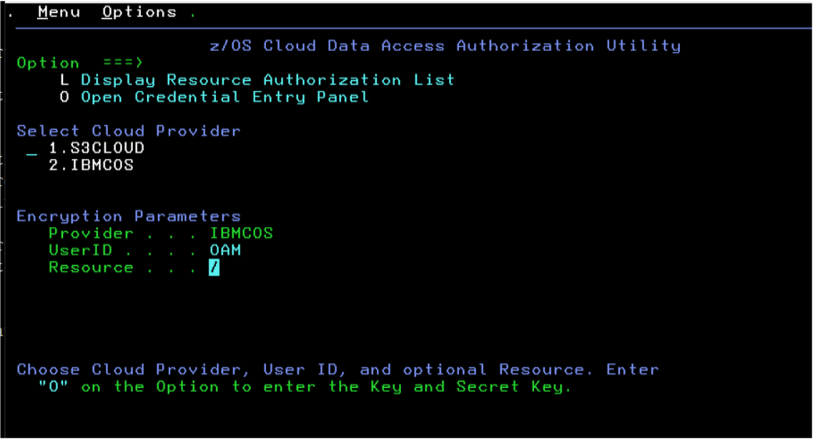
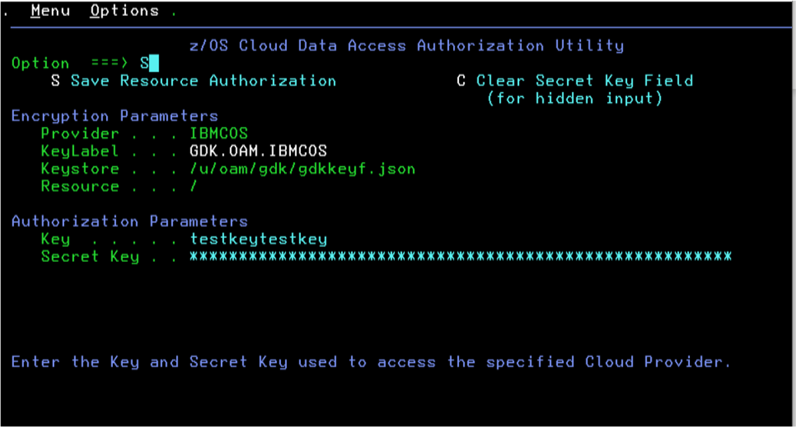

Who would’ve predicted that you can now store your Object Access Method (OAM) object data as objects in the cloud? 
From 1-byte to 2000-MB, your OAM objects can be initially stored to the cloud or later transitioned to the cloud by 
using the same SMS policies that you’ve grown to love.  

## What Is OAM?

OAM is a component of IBM z/OS® DFSMSdfp and is one of many access methods in DFSMS. It uses a new access method—Cloud Data Access (CDA) 
Services—to store, retrieve and delete data to the cloud. With APAR OA55700 (z/OS V2R3 and later), OAM now supports a cloud tier in its 
storage hierarchy in addition to the existing support for disk, optical and tape tiers.  

If you’re not familiar with OAM, as shown in Figure 1, applications use the OAM API (OSREQ) to store unstructured byte 
stream data as objects. OAM then stores its metadata for an object and other related information in IBM Db2® tables. 
We like to think that we were cool, long before cloud and its use of “objects” even came along. To OAM, an object is simply a 
string of bytes and can contain scanned images, statements of record, PDF files, video files and the like. OAM is used in the 
healthcare, insurance, financial, government and services industries, to name just a few. The IBM DB2 Content Manager and IBM DB2 
Content Manager OnDemand products on IBM Z® use OAM to store and manage their data. Clients have also used the OSREQ API to write their own applications. 

With the ability for OAM to co-locate data by using object storage groups and collections, you can base your SMS policies on usage 
characteristics of the data. If you have data that is frequently accessed, you can keep that data on disk until it gets a bit colder, 
and if you also have colder, archival-type data, you can immediately store that data to a colder storage tier. To assist with managing 
your policies, we also support SMF records (record type 85) with new subtypes that were created for cloud. With SMS policies and OAM, 
you can store the object data to the right location at the right time and then have OAM automatically manage the lifecycle of that data 
within the hierarchy from creation to expiration.

## Our Cloud Support

With OA55770, the use of Cloud Data Access (CDA) services and SMS policies, you can now store the primary copy of an OAM object as an 
object to a public or a private cloud that supports the S3 API. The ability to recall an object stored in the cloud to the disk level of 
the storage hierarchy is also provided. If, for instance, an object stored in the cloud needs to be frequently accessed for a month, OAM can 
be instructed to place a copy of that object on disk for faster access. Objects recalled to disk can be placed in Db2 or in a zFS or NFS 
mountable file system. OAM-managed backup copies continue to be supported on removable media, typically virtual or physical tape.

## Configuration and Usage

**OAM Configuration Changes**

The steps for configuring OAM to use the cloud is similar to the steps for configuring OAM to use the other storage 
tiers in the hierarchy. The SMS Storage Class construct is used to tell OAM that the data should reside in the cloud 
(IARS=0 and OAM sublevel=3). Appropriate ACS routine changes are also needed to assign any new or updated storage classes. 
A new SETCLOUD statement in the CBROAMxx member of PARMLIB specifies information about the cloud storage that is being used. 
In particular, information about the cloud provider and the containers being used is specified. To provide maximum flexibility, 
each primary object storage group can be associated with its own container in the cloud, or multiple object storage groups can 
use the same container. To track where an object resides in the cloud, a new Db2 table (CLOUDID) holds information about cloud 
storage locations such as the cloud provider and container name. This table makes it easier to update the provider and container 
that is associated with a primary object storage group. Retaining knowledge of where existing objects are stored enables us to 
retrieve those objects. An example of the new SETCLOUD statement specified for an object storage group is as follows:

    SETCLOUD STORAGEGROUP(SGROUP1 PROVIDER(IBMCOS)

    CONTAINER(SGROUP1BUCKET))

The SETCLOUD statement can be specified at either the global level, the individual object storage group level, or both. 
Optionally, you can configure the SETOPT and SETOSMC statements in the CBROAMxx member of PARMLIB to enable the automatic 
access to backup and recall functions for objects stored in the cloud.

When we talk about the CDA services, we’ll discuss how the information specified in the SETCLOUD statement is passed to CDA and then used by it.

**CDA Services**

CDA is a new component in z/OS DFSMSdfp and is used internally by OAM. It provides a set of generic services (APIs) 
for OAM to store (PUT), retrieve (GET) and delete (DELETE) objects in the cloud. The CDA API takes advantage of the 
z/OS Client Web Enablement Toolkit and the z/OS SSL interfaces for communication with the cloud server. Only secure 
HTTPS connections are supported for connecting to the cloud provider.

New UNIX® directories and files for key files and cloud provider definitions are required to configure CDA. 
To securely enter and protect the cloud credentials, new ISPF panels are provided. Lastly, ICSF and RACF 
(or an equivalent security product) are used to encrypt and protect the cloud credentials. RACF user and group 
IDs for OAM must be created and configured along with a RACF group for OAM administrators.

The information specified on the SETCLOUD statement is then used by CDA to access the provider file and encrypted credentials to build a HTTPS request for OAM.  

The following two panels in Figure 2 and Figure 3 show how the cloud credentials pertaining to OAM are entered on the new ISPF panels:

In those examples, the entered resource pertains to the containers. In this case, the same credentials are 
used for all containers associated with OAM. Different credentials can be set up for each container as needed.

## Availability

Now that you’re ready to store OAM objects as objects in the cloud, the sky is the limit! Start with OAM APAR OA55700 
and if coexistence is needed, see APAR OA55701. We’ve only touched upon some of the key highlights of the support. 
For more information about the installation steps for both OAM and CDA and for details on the support, 
refer to the [OAM-Cloud-Installation-Guide](ftp://public.dhe.ibm.com/eserver/zseries/zos/DFSMS/OAM/OA55700). 
The installation guide walks you through the different steps that a system administrator, a storage administrator and a security administrator would perform.   

## More Resources

- [z/OS DFSMS OAM Planning, Installation, and Storage Administration Guide for Object Support](https://www-01.ibm.com/servers/resourcelink/svc00100.nsf/pages/zOSV2R4sc236866?OpenDocument) 
for information on OAM’s object support and the functions the support provides.
- [z/OS DFSMS OAM Application Programmer's Reference](https://www-01.ibm.com/servers/resourcelink/svc00100.nsf/pages/zOSV2R4sc236865?OpenDocument) 
for information on the OSREQ API and the functions it provides.

## About the author

Erika Dawson is an STSM and z/OS DFSMS product architect.

Peter Sobik is a z/OS DFSMSdfp OAM developer with a focus on tape and cloud storage tiers.

Andrew Wilt is a z/OS DFSMS product architect.