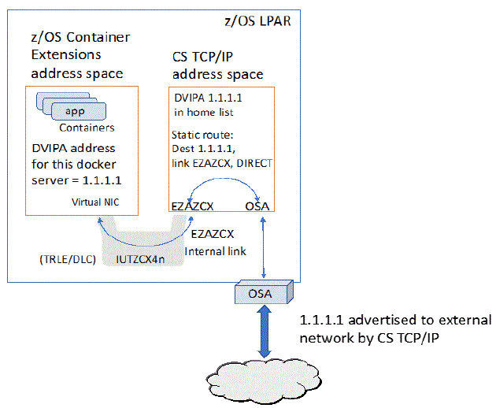
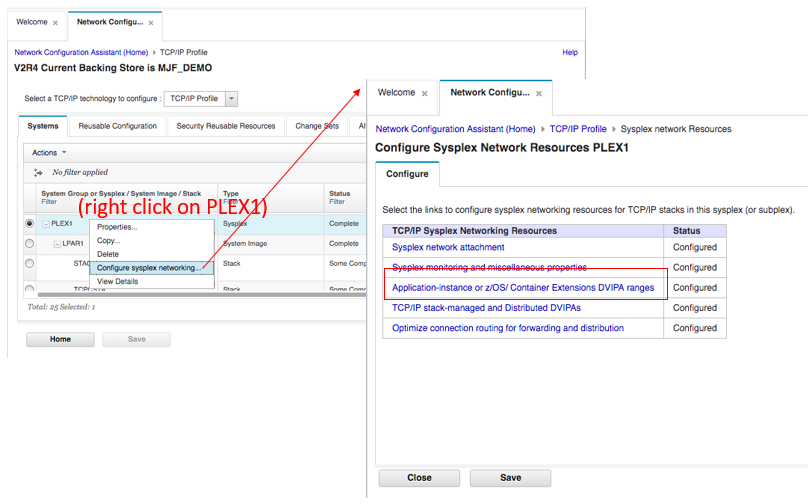
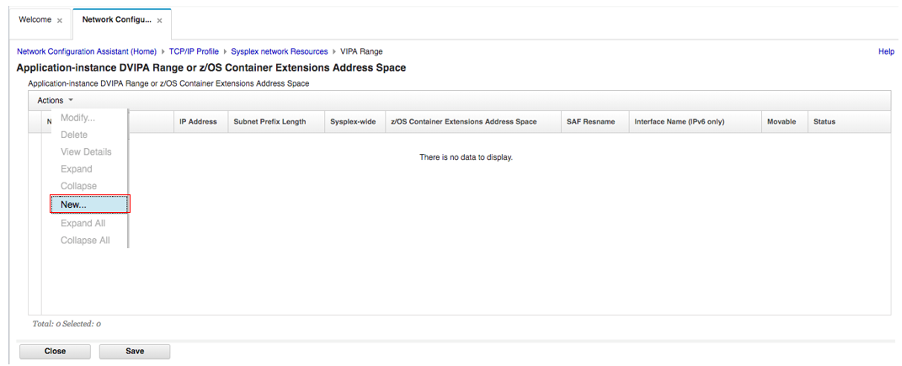
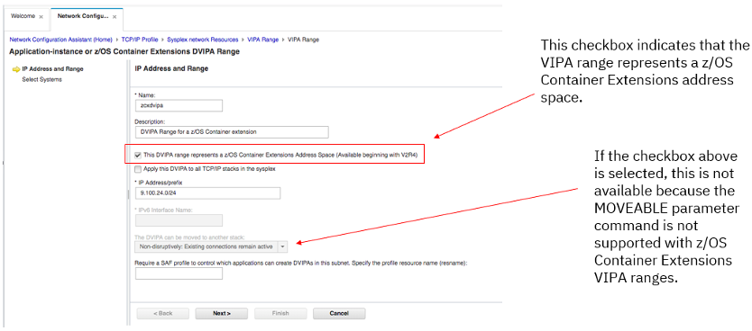
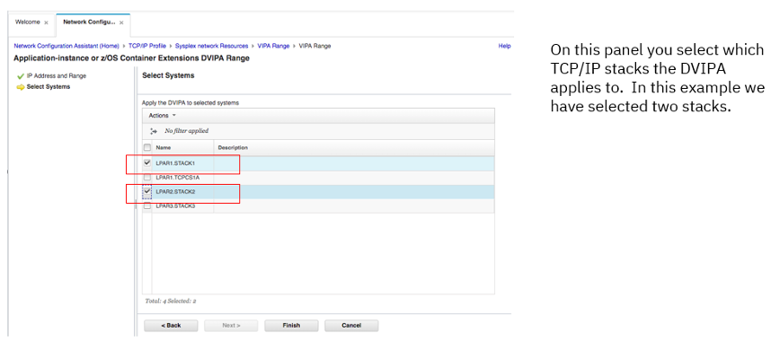
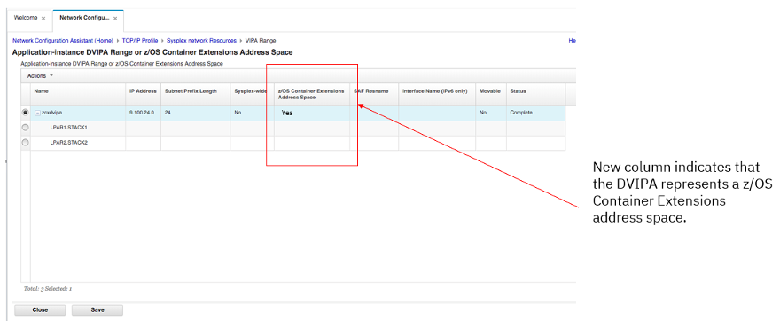
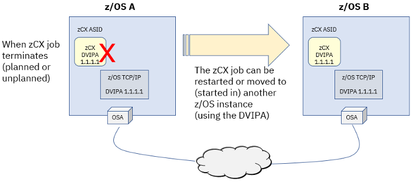

Everybody knows that Linux* runs on IBM Z*, but what if you could build a hybrid workload consisting of 
native z/OS software and Linux on Z software, both running in the same z/OS* image?

Starting from z/OS V2R4, with an exciting new feature named IBM z/OS Container Extensions (zCX), 
you have a new way to run Linux on IBM Z Docker containers in direct support of z/OS workloads on the 
same z/OS system. It builds much more flexibility into operations on IBM Z by modernizing and extending z/OS applications.

“With zCX, customers will be able to access the most recent development tools and processes available in Linux on the Z 
ecosystem, giving developers the flexibility to build new, cloud-native containerized apps and deploy them on z/OS without 
requiring Linux or a Linux partition,” says Ross Mauri, general manager for IBM (ibm.co/2W04VWW).

See the zCX website (ibm.co/2JaDzWe) if you are interested in more details.

## IBM zCX Networking Support

z/OS V2R4 Communications Server has added network support for zCX.
The Communications Server support provides network support for zCX workloads by introducing a new type of 
DVIPA called a zCX DVIPA, created with the VIPARange statement. The zCX DVIPA represents an instance of a 
Docker server allowing TCP/IP to provide unique IP routing and apply various TCP/IP QoS functions for container 
workloads running within each Docker server address space. For a high-level zCX network overview of key concepts, see Figure 1.

.")

The Communications Server VTAM support introduces a new type of zCX network transport that dynamically provides optimized internal 
network connectivity from each Docker server ASID to TCP/IP for providing access to and from colocated z/OS applications, and to 
and from the external network. The VTAM support also introduces the zCX Direct Network Interface Component (DNIC) that provides a 
Virtual NIC for the Docker server virtualization environment.

Figure 2 provides an overview of the z/OS Communications Server support provided for the zCX environment.

## Steps to Enable Network Support for zCX

1. Use the z/OSMF workflows to create the zCX environment. Here is the zCX network information needed for each zCX instance (inputs to z/OSMF zCX provisioning workflow):

- zCX server IP address—an IPv4 zCX DVIPA

- DNS server IP addresses (up to two for resiliency)

- DNS search domain (i.e. pok.ibm.com or ibm.com)

- MTU (optional, default = 1492, suitable for most environments)

- TCP/IP stack name (only needed if multiple TCP/IP stacks are configured/active on the z/OS system)

2. Update the z/OS TCP/IP profile:

- Configure zCX DVIPAs (IPv4 and optionally IPv6) by using VIPARANGE statements (ibm.co/2W5x8t2). 
The DVIPA must match zCX server configuration (must match the z/OSMF workflow configuration in step 1 above). 
The same VIPARANGE statements should be replicated across all systems in the sysplex that you want to start this zCX instance on.

- EZAZCX interface is created when the EZASAMEMVS (*samehost*) interface is created. When using DynamicXCF or enabling IUTSAMEH 
for Enterprise Extender both EZASAMEMVS (*samehost*) and EZAZCX interfaces are dynamically created and started. If 
you are not using Dynamic XCF or Enterprise Extender, you must manually define (dev/link/home) IUTSAMEH (which will also create EZAZCX). 

3. Update the OMPROUTE profile:

- Updates for zCX Dynamic VIPAs being used. They are the same as other DVIPAs. Use wildcarding where possible to simplify configuration.

- Remember to propagate these to all other systems in the sysplex that this zCX instance may be started on.

4. Configure the IPSec policy. If you have IP Filters defined, you need to ensure that you permit routed and local traffic for these DVIPAs.

5. Control the VIPARANGE DVIPA creation through two SERVAUTH profiles:

- EZB.MODDVIPA.*sysname.tcpname*

    Limit who can create a VIPARANGE DVIPA in general.

- EZB.MODDVIPA.sysname.tcpname.resname

    Limit who can create a specific VIPARANGE DVIPA:

    - VIPARANGE DEFINE 255.255.255.255 10.10.10.1 *SAF APPL1*

    - Profile: EZB.MODDVIPA.*sysname.tcpname.APPL1*

- If either of these two profiles are enabled, the user ID associated with the zCX started task will require READ access to these profiles.

- If these profiles are not enabled, the user ID associated with the zCX started task must be UID(0) or have READ access to the BPX.SUPERUSER FACILITY class profile.

## Network Configuration Assistant Support for zCX

You can set VIPARange DVIPA ZCX in Network Configuration Assistant (NCA) by performing the following steps:

Go to the sysplex networking panel and select Application-instance or z/OS Container Extensions DVIPA ranges (see Figure 3)

Create a new VIPA range (see Figure 4).

Set the zCX flag in the new VIPA range (see Figure 5).

Select systems (see Figure 6).

See the results (see Figure 7)

## Best Practices for zCX Resiliency

- Review your firewalls to see how they will handle the IP address for the zCX DVIPA. 

- You can use the VIPARange statement to define zCX DVIPAs in multiple z/OS hosts. This will allow the zCX DVIPA to be moved between systems. For example, see Figure 8.

## Monitoring zCX Network Activity

z/OS TCP/IP provides various Netstat enhancements for zCX, allowing administrators to monitor zCX network related status and activity. 
The following list is a sample of some of the tasks and displays for zCX network related information:

1. DVIPA zCX defined (VIPARange ZCX): Netstat VIPADCFG

2. EZAZCX stack interface defined and activated: Netstat DEVL,INTFN=EZAZCX

3. Using the zCX jobname and a zCX display command, verify that your zCX z/OSMF network related configuration matches your TCP/IP (DVIPA ZCX) configuration: F *jobname*,DISPLAY,NET

4. zCX DVIPA has been activated (by the correct zCX instance / job): Netstat VIPADYN

5. zCX server (job) and TCP/IP stack connected to zCX internal network: D NET,TRL,TRLE=IUTZCX41

6. Verify that network traffic is flowing to a specific zCX server (container workloads have been deployed and started): Netstat DEVL,INTFN=DVIPAname

## More Resources

Learn more about zCX:

- IBM z/OS Container Extensions network overview (ibm.co/2pNdntR)

- Network support for z/OS Container Extensions (ibm.co/2P9kpE8)

- IBM z/OS Container Extensions Guide (ibm.co/2MBgL3X)

## About the author

Jerry Stevens is a senior technical staff member with IBM Systems Unit Enterprise Networking Solutions architecture, strategy and design team.

Erin Zhang is the content designer for Enterprise Network Solutions in IBM Systems.