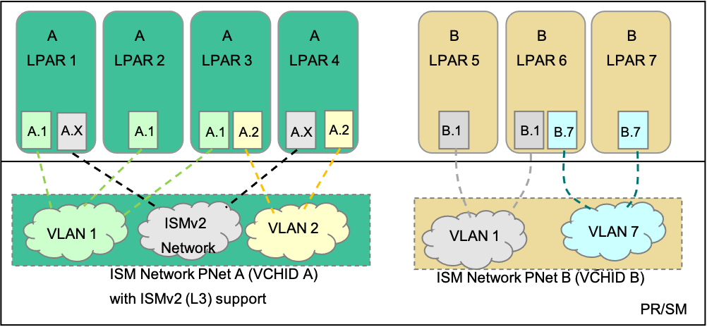
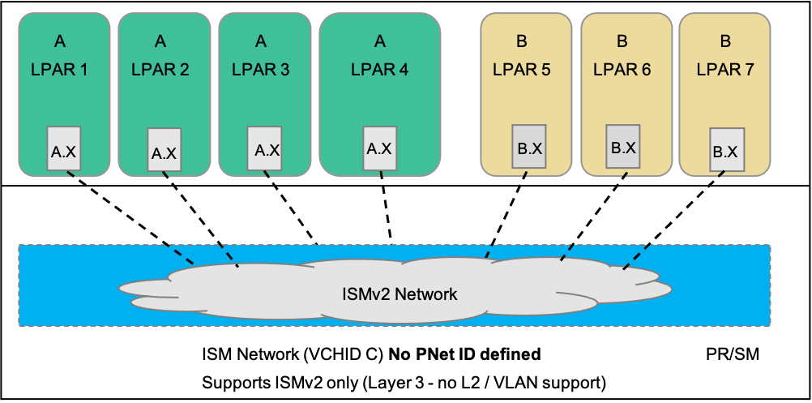

Have you ever noticed a perfectly suitable walkway constructed using commercial-grade materials 
between two buildings and nearbys, there’s a well-worn path that’s been formed by most of the 
pedestrian traffic going between the same buildings? What’s going on here? Why aren’t people 
using the constructed walkway?

About four years ago, those were the words we used to first introduce you to Shared Memory 
Communications—Direct Memory Access (SMC-D). The Hot Topics article was titled “Taking the 
Direct Path With Shared Memory Communications—Direct Memory Access.” In that article, we used a 
college campus bustling with foot traffic to prove the old adage that “time is money.” At that 
busy campus, students and professors would go about their daily routines. Over time, patterns are 
formed, and you can see they tend to naturally find the most efficient routes to take to get from 
building to building. The prescribed routes laid out by the manicured sidewalks takes a back seat 
to the shorter and more direct routes across the dirt path which cuts across the greenway. Although 
the sidewalk is perfectly fine, it might be a longer route and considered out of the way, while the 
well-worn path is the most direct path. It’s the direct path that represents the savings.

We can use this simple analogy and apply it to technology. In our case, the “buildings” on the 
campus are unique IBM z/OS® instances---logical partitions (LPARs) or guest virtual machines---running 
within IBM Z® (the “campus”). The “students and professors” are the network packets carrying application 
data (network traffic). Today, several existing z/OS options for communication paths (“sidewalks”) are also 
constructed out of perfectly suitable materials. While the existing technology options provide a communication 
path, SMC-D provides the most optimal and direct path because it was designed specifically for intra-CPC communications.

So, if SMC-D is such a great technology, what’s this SMC Version 2 communications all about? When SMC 
was first architected, it had an inherent limitation in that it was based on Layer 2 technology. If 
you picture yourself back at your college campus, imagine you ran over to grab breakfast at the cafeteria 
which was right across the quad in the East Halls. However, after breakfast you had to dash over to the West 
Halls which was separated by a larger barrier or fence. This barrier prevented anyone from taking the short 
path when crossing from East to West Campus. If we apply this analogy to SMC, the specific areas of the campus 
are similar to IP subnets within your enterprise. In the original SMC architecture, the client and server were 
required to reside in the same subnet, just like your dorm and the cafeteria example. So, how can the direct path 
be used across subnets?

SMC in its original form (SMC Version 1) has been limited to communications for hosts attached to a 
common IP subnet. SMC Version 2 removes this limitation by enabling SMC over multiple IP subnets. 
The SMC Version 2 multiple IP subnet support unleashes SMC capability to additional application workloads 
that were previously ineligible for SMC!

## SMC Version 1 Connection Eligibility

Recall that the original version of SMC was based on Layer 2 communications (i.e. a LAN). This means 
the scope of communications was defined by the physical network (LAN) and possibly a virtual LAN 
(when VLANs are defined). Since communications were limited to Layer 2, 
SMC connections could not cross IP subnets (i.e. limited to a single subnet).

")

Figure 1 of the IBM Z Internal Shared Memory architecture illustrates two important SMC-D Version 1 key concepts:

1. How ISM inherits the associated IP networks’ Layer 2 attributes (from OSA (Ethernet) or HiperSockets 
(Internal Virtual Network)) of the physical network (based on PNetIDs) and virtual network (based on the VLAN IDs)

2. How ISM communications can isolate a group of systems (i.e. Group A and Group B) using unique PNetIDs 
(ISM VCHIDs) or unique VLANs on the same network

The key point of Figure 1 is to establish an understanding of the base concepts of SMC Version 1 by 
noting how ISM adheres to the user’s existing Layer 2 topology attributes of the associated IP network 
configuration. In this case the ISM interfaces are associated with an OSA or HiperSockets interface (not shown).

A TCP/IP connection is eligible to use SMC-D Version 1 over this ISM network path when the network IP 
topology of the associated TCP/IP connection is within the same IP subnet (e.g. LPARs 1 and 2). However, 
if the IP topology crossed IP subnets using an IP router (e.g. LPARs 1 and 4) then this TCP/IP connection would 
not be eligible for SMC (using SMC-D Version 1).

## Introducing SMC-D Version 2 and ISM Version 2

IBM z/OS Communications Server V2R4 introduces SMC Version 2 multiple IP subnet capability for SMC-D (SMC-D Version 2)[1]. 
The IBM z15™ introduced updates to the ISM feature, referred to as ISM Version 2 that removes the existing Layer 2 
(PNetID and VLAN ID) attributes and definitions.

In order to provide an ISM connection that is not restricted to the existing Layer 2 topology and rules, a new 
form of “ISM Layer 3” internal connection was required. This type of ISM connection could not be associated with 
or bound to the existing Layer 2 physical or virtual networks (VLANs).

When the IBM Z OSes that support SMC-D connecting to the ISM VCHID are updated to support the new ISM Version 2 
connectivity feature, then the multiple IP subnet solution of the SMC-D Version 2 protocol can be exploited.

SMC-D Version 2 and ISM Version 2 provide multiple IP subnet support while co-existing with same subnet down-level hosts.

## SMC-D Version 2 and ISM Version 2 Solution

Using SMC-D Version 2 with ISM Version 2, Figure 2 illustrates the solution and the main concepts of how 
LPARs 1 and 4 can now communicate over multiple IP subnets.
Previously, with SMC-D Version 1 the TCP connection between LPARs 1 and 4 was not SMC eligible due to the 
cross IP subnet limitation and would fall back to TCP communications over OSA or HiperSockets.

This figure illustrates some of the main concepts of SMC-D Version 2 and ISM Version 2 as follows:

1. Both LPARs 1 and 4 have an internal Layer 3 connection to ISM VCHID A that is created for the SMC-D 
Version 2 solution (shown here as A.X interfaces). LPARs 1 and 4 have software updates to support the SMC-D 
Version 2 protocol and the new ISM Layer 3 capability.

2. The ISM Layer 3 connection to VCHID A does not use any Layer 2 attributes (such as a VLAN ID)

3. As shown here in this example 1, VCHID A is associated with a PNetID A and VCHID B is associated with PNetID B. 
The ISM VCHIDs are considered to be “**associated ISM VCHIDs**” meaning the ISM VCHIDs:

    a. Are defined (in HCD) with a PNetID (the CHIDs are “associated with” a physical network) and this attribute allows the VCHIDs to

    b. Will be associated with IP interfaces (such as OSA or HiperSockets) when they are defined with matching PNetIDs. This PNetID association is required for SMC Version 1 (single subnet Layer 2 support).

## SMC-D Version 2 Only Configuration

In an environment where down-level systems are not present where ISM Version 1 is not required, a user might 
elect to have an IBM Z configuration where a minimal number of ISM VCHIDs are used. Here all operating systems 
are now up-level (all support SMC-D Version 2). This could be a user rolling out SMC-D for the first time or an 
existing SMC-D user who has updated all operating system software. This user could simplify their ISM configuration 
by exploiting ISM Version 2 only with a non-associated ISM VCHID (no PNetID). In this environment the ISM topology 
is greatly simplified. For a visual of this configuration, see Figure 3.

Note that in this configuration each host now has a single ISM interface that is not associated with any IP interfaces 
(no Layer 2 attributes). The IP topology (single versus multiple IP subnets) of the associated TCP/IP connections becomes 
irrelevant for SMC-D Version 2.

## The Benefits of SMC-D Version 2 and ISM Version 2

What are the savings for exploiting SMC-D Version 2 with ISM Version 2? The operational benefits of connecting same subnet 
or cross-subnet with SMC-D communications are comparable. SMC-D Version 2 is simply an enhancement which allows more of 
your applications to benefit from SMC-D Version 2 by using the ISM Version 2 transport.

## Saving on CPU Costs, Reducing Latency and Increasing Throughput

SMC is a powerful IBM Z enterprise data center network communications solution that has the potential to 
offer you savings in network related CPU costs, reducing latency increasing and throughput. The original 
version of SMC is limited to TCP connections for hosts (client and server) that have direct access to the 
same IP subnet. This single IP subnet limitation restricts SMC exploitation to a subset of IBM Z workloads. 
In some configurations this limitation could be overly restrictive.

SMC-D Version 2 and ISM Version 2 lift the single IP subnet limitation for an IBM Z system (CPC) extending the 
SMC-D solution and potential savings to additional IBM Z workloads in your enterprise.

Are you ready to unleash the power of SMC Version 2 in your enterprise?

## Learn more

[Learn more about SMC-D Version 2 and ISM Version 2 and the benefits of this new technology.](https://www.ibm.com/docs/en/zos/2.4.0?topic=communications-shared-memory-reference-information)

## About the author

Randall Kunkel is a senior software engineer in IBM Systems Unit Enterprise Networking Solutions development team.

Jerry Stevens is a senior technical staff member with IBM Systems Unit Enterprise Networking Solutions architecture, strategy and design team.