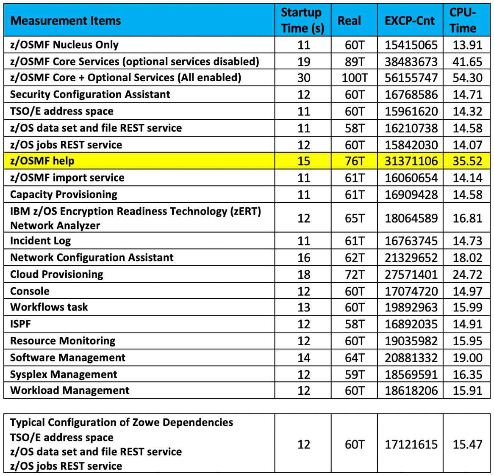

IBM z/OS® Management Facility (z/OSMF) provides extensive z/OS system management functions in an easy-to-use, 
web browser-based UI. With z/OSMF, system programmers can more easily manage the day-to-day operations and administration 
of your mainframe z/OS systems.

Recent enhancements to z/OSMF offer a new UI for streamlining your z/OSMF operations. 
You can more easily select which core and optional services to enable or disable without having to edit the z/OSMF parmlib member.

## z/OSMF Lite

Prior to z/OSMF V2R4, a base z/OSMF configuration included 14 core services, regardless of whether you planned to use them all. 
To enable each service, you needed to customize your z/OS host system and create security product definitions.

In z/OS V2R4, we introduced the “z/OSMF Lite” concept. This simplified approach to set-up requires only a minimal amount of 
host system customization but provides the key z/OSMF functions that you require. You just need to configure a 
lightweight z/OSMF “nucleus” and whichever additional services you plan to use. Leave any unwanted services unconfigured.

The initial support for z/OSMF Lite allowed you to disable only the nine optional plug-ins of z/OSMF by disabling them in 
the z/OSMF parmlib member (IZUPRMxx). The 14 core services are not defined in IZUPRMxx and therefore could not be disabled. 
Though the core services offer useful functions, each one adds to the z/OSMF “footprint” and therefore contributes to the server start-up time.

In your feedback on z/OSMF Lite, you told us that you would prefer to disable those unused core services for potentially better performance. 
Thanks for the feedback—we heard you! Read on for more details.

## Select Your z/OSMF Services “A La Carte”

When you apply APAR PH24527, the Services tab is added to the General Settings page in z/OSMF. 
This new, user-friendly UI allows you to enable or disable z/OSMF services with just a mouse click. 
Think of it as ordering your z/OSMF core functions like restaurant entrees “a la carte.” You can, for example, choose to enable only the z/OSMF REST services and skip everything else.
 
What happens if you change your mind later? No worries, you can always add those skipped services to your existing configuration later.

## Tailoring Your Configuration Is Easy

Let’s take a closer look at the new Services tab. On a system with APAR PH24527 installed, log in to the z/OSMF desktop and click the General Settings icon.

Then, click the “Services” Tab to display the z/OSMF services. Here, you can review the complete set of z/OSMF services and determine whether any can be enabled or disabled.

z/OSMF currently includes 14 core services and nine optional services. To select or deselect a service, click the associated toggle.

As you make selections, the Service tab identifies interdependencies between z/OSMF functions to help you avoid disabling something you shouldn’t. 
Some z/OSMF services prerequisite other services, so you might find that you need to configure a few more services than the ones you planned to use.
 
For example, if you choose to disable the z/OS jobs REST APIs when z/OSMF workflows are enabled, the Services tab warns you that the Workflows task 
might be adversely affected if you continue. That’s good to know!

## A Closer Look at z/OSMF Resource Consumption

In a typical z/OS system with many interactive users, the z/OSMF online help provides a wealth of information about how to use the various capabilities of z/OSMF. 
The online help is a best-in-class example of comprehensive IBM user assistance.
 
If you run z/OSMF in a small system, however, or in the IBM Z® Personal Development Tool (zPDT), you might consider disabling the z/OSMF help for better performance. 
You can disable the help on the Settings page.

In internal tests, we found that the z/OSMF help uses about 50% of the CPU-time for z/OSMF core services. 
For performance-critical systems and secondary servers that are intended to handle specialized workloads (REST APIs), 
disabling the z/OSMF help can significantly improve the z/OSMF server startup time. Note that the full set of z/OSMF help content is available in the [z/OS Knowledge Center](https://www.ibm.com/docs/en/zos/2.4.0?topic=facility-zos-management-online-help).

For comparisons of z/OSMF server startup performance, see the lab results below. 
This test was performed on a z/OSMF system with a dedicated CP with 8G of memory, Java 8 SR5, and WebSphere® Liberty version 20.0.0.3.

## Act Now and a Slimmer z/OSMF Can Be Yours Today

The new Services tab in the General Settings page gives you the flexibility to shape z/OSMF more closely to your needs. 
By omitting functions that you don’t use, you can potentially reduce resource consumption and server start-up time. You also keep your z/OSMF desktop looking tidy and free of icon clutter.
 
Begin today by verifying that APAR PH24527 is installed on your system. Then check out that new Services tab!

## About the author

Zhi Li is the product owner and team lead for the z/OSMF Configuration Squad.

Wayne O'Brien leads the Content Team for z/OSMF.