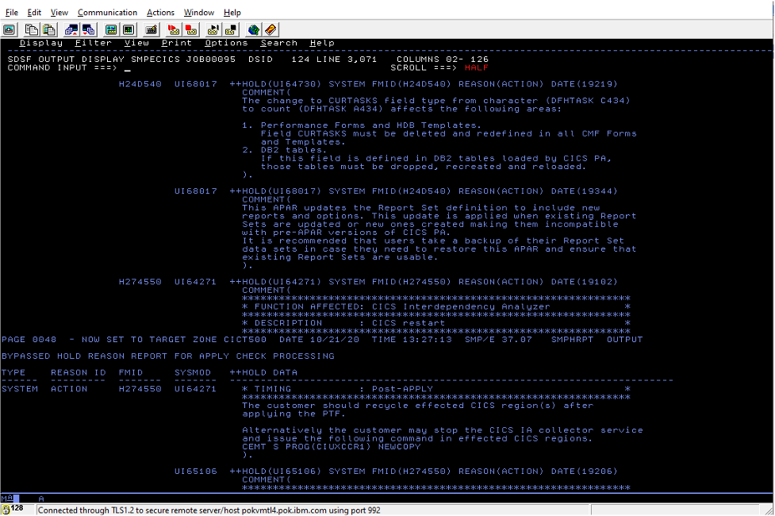
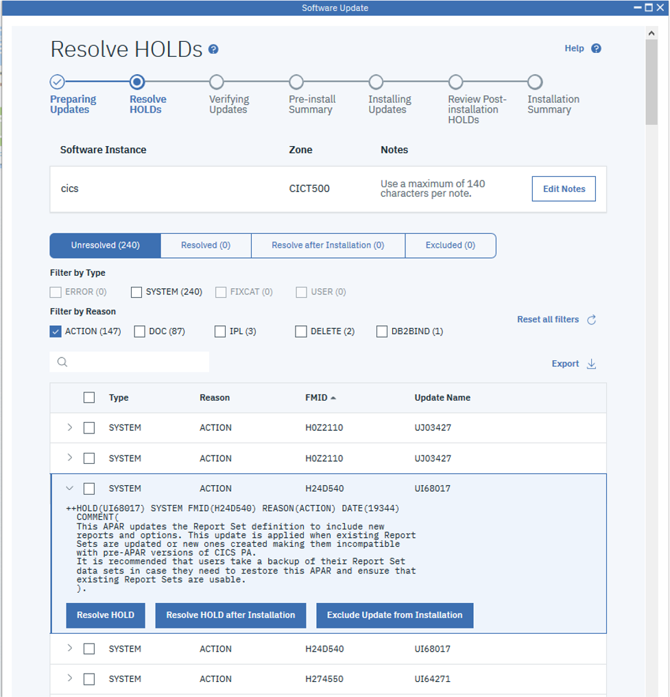
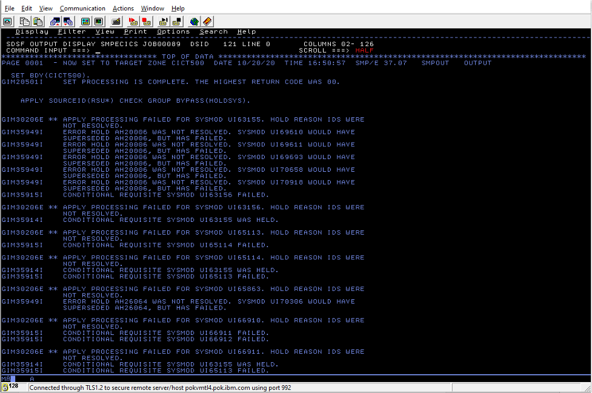

We all love updating our IBM z/OS® software. We get to research and
build long, convoluted JCL APPLY commands, sift through cryptic,
never-ending SMP/E output to investigate and resolve HOLDs, and spend
hours solving errors only to discover that they weren't errors that
needed solving! It's all a hoot. Oh, not for you? Yeah, not for us
either.

Thankfully, the new z/OSMF Software Update task, introduced in z/OS
Version 2 Release 4 with the PTF for APAR PH28412, has come to your
rescue. It provides a GUI that z/OS system administrators and system
programmers can use to easily manage updates for installed SMP/E managed
software. In other words, you can now apply updates to existing software
instances and manage update processes without having to suffer through
running SMP/E JCL or manually combing through the output and messages!

## Key Features and Benefits

z/OSMF Software Update features include:

-   You can identify and install updates on your software instances all
    from within user-friendly z/OSMF. You can then easily manage
    in-progress update processes and view details about completed update
    processes. There are three main actions in Software Update:

    -   Install **corrective software updates** to fix a problem

    -   Install **recommended software updates** when they are supplied
        by a software vendor

    -   Install **functional software updates** by fix category to
        support new hardware, software, or function

-   Because you manage all of the update processes from within the
    z/OSMF GUI, you don't need to touch SMP/E as you know it. (So, for
    you newbies to the system, you can now safely admit that you have no
    idea how to build an SMP/E APPLY command without fear of
    retribution.)

-   Users can collaborate on a single software update process. So, you
    can kick it off and then pass it along to others to, for example,
    resolve different HOLDs.

## Before and After z/OSMF Software Update: 2 Scenarios

## 1. Resolving HOLDs

Up until now, resolving HOLDs hasn't been your favorite activity, right?
You had to open the never-ending SMP/E output, find the relevant HOLD
information, interpret it, track down HOLD information that might exist
in the SMP/E output for other related PTFs and somehow keep your sanity.

Let's take a look at what that process entailed before and then show you
how simple it is now with z/OSMF Software Update.

**Resolving HOLDs Before z/OSMF Software Update**

When you install an update, you first need to build and run your APPLY
command:

+----------------------------------------+
| APPLY SOURCEID(RSU* HIPER SECINT PRP) |
|                                        |
| BYPASS(HOLDSYS)                        |
|                                        |
| GROUP                                  |
|                                        |
| CHECK.                                 |
+----------------------------------------+

During the update processing, SMP/E spits out an enormous flat text file that you 
then need to manually review to be able to resolve the HOLDs. Figure 1 shows a tiny 
snippet of the SMP/E output, showing what the HOLD information might look like.

Scary, huh? It takes a lot of training to know what to look for and where to find it in 
the SMP/E output. You need to find the relevant HOLD information and then interpret it, 
be able to tell whether you then need to track down HOLD information that might exist in 
the SMP/E output for other related PTFs, and so on. It’s quite a painstaking, laborious job.

Then, after you finally identify and handle all the HOLDs, you might
have a list of PTFs that you'll choose to save for later because you
don't want to resolve their HOLDs right away. For example, suppose some
PTFs make behavior changes to the installed software that you just
can't accommodate right now. In this case, you need to run the APPLY
command AGAIN to exclude those PTFs. That nice APPLY command that you
ran at first could then get complicated pretty quickly:

+---------------------------------------------------------+
| SET BDY(TGTZ).                                          |
|                                                         |
| APPLY SOURCEID(RSU* HIPER SECINT PRP)                  |
|                                                         |
| BYPASS(HOLDSYS)                                         |
|                                                         |
| EXCLUDE(                                                |
|                                                         |
| UI59009 UI64019 UI64225 UI65596 UI68417 UI62015 UI64732 |
|                                                         |
| )                                                       |
|                                                         |
| GROUP                                                   |
|                                                         |
| CHECK.                                                  |
+---------------------------------------------------------+

Not fun. Thankfully, this process is no longer your only option.

**Resolving HOLDs After z/OSMF Software Update**

Now, with z/OSMF Software Update, you don't need to run APPLY commands,
and there's no need to search through or even open the SMP/E output. The
task keeps track of and organizes all the HOLD data (even that for other
related PTFs) for you.

After Software Update prepares the updates, it presents you with a list
of all HOLDs right there in the GUI. Figure 2 shows an example of the
Resolve HOLDs page showing those same HOLDs and what you can do with
them.

All you need to do is click on a HOLD to review its contents, then click
a button to tell Software Update what to do with it. There are three
options:

1.  To resolve the HOLD immediately, you need to only review its
    contents in the GUI, complete any necessary actions, and then click
    **Resolve HOLD**. The HOLD moves to the Resolved list.

2.  To commit to resolve the HOLD after installation of the update, you
    need to only click **Resolve HOLD after installation**. The HOLD
    moves to the Resolve after installation list and the Software Update
    task reminds you of the HOLD after the update is installed.

3.  If the HOLD contains actions that you choose to not complete during
    the update installation process and you choose to exclude the
    update, you need to only click **Exclude Update from installation**.
    The HOLD moves to the Excluded list.

But wait, there's more! Another perk of the Resolve HOLDs function in
Software Update is that different users can collaborate on a single
software update process to resolve different HOLDs. Time to break out
the virtual canapes!

## 2. Dealing With PTFs in Error

Have you ever installed recommended service and been told that you have
a "PTF in error" (PE)? Has it then nagged at you and you can't relax
until you figure out what the error is and what you need to do about it?
Us too! Well, here comes Software Update to calm all our nerves.

**Dealing With PTFs in Error Before z/OSMF Software Update**

Before Software Update, SMP/E simply threw errors to announce that any
number of your recommended updates were PE. Figure 3 shows a tiny
snippet of the SMP/E output, showing information about the failure of
some recommended updates.

Because you're fastidious and don't like the idea of errors anywhere,
you then spent precious time investigating the errors. The problem
there, though, is that there was really no need to resolve those
errors---you should actually just ignore PEs! But that's not obvious
when you're just looking at a pile of SMP/E output.

**Dealing With PTFs in Error After z/OSMF Software Update**

Now, with Software Update, if any of the recommended updates are PEs, it
simply ignores them like you should do anyway.

After Software Update looks for available recommended updates for the
selected software instance and zone, it displays the Finding Updates
page (see Figure 4). If valid updates are found, it simply notifies you
of that, and any PEs that are found aren't even mentioned:

Out of sight, out of mind!

So, you don't need to spend time "resolving" PEs or even thinking about
them.

**Interesting tidbit:** When you get to the step in the process where
the valid recommended updates are actually installed, Software Update
issues an APPLY command in the background that excludes all found PEs.
Such a command might look something like this beast:

+-----------------------------------------------------------------+
| SET BDY(TGTZ).                                                  |
|                                                                 |
| APPLY                                                           |
|                                                                 |
| SOURCEID(RSU* SECINT HIPER CAR* RSL* PRP)                    |
|                                                                 |
| GROUP                                                           |
|                                                                 |
| BYPASS(HOLDSYSTEM HOLDUSER HOLDFIXCAT)                          |
|                                                                 |
| EXCLUDE(UI63155 UI63156 UI65113 UI65114 UI65863 UI66910 UI66911 |
|                                                                 |
| UI66912 UI67010 UI67011 UI67012 UI67013 UI67023 UI67024 UI67025 |
|                                                                 |
| UI67091 UI67366 UI67367 UI67493 UI67494 UI67508 UI67659 UI67700 |
|                                                                 |
| UI68368 UI68467 UI68508 UI68509 UI68510 UI68669 UI68675 UI69119 |
|                                                                 |
| UI69120 UI69218 UI69225 UI69407 UI69408 UI69409 UI69441 UI69610 |
|                                                                 |
| UI69611 UI69692 UI69693 UI69694 UI70122 UI70123 UI70124 UI70185 |
|                                                                 |
| UI70285 UI70306 UI70397 UI70572 UI70639 UI70658 UI70659 UI70797 |
|                                                                 |
| UI70918 UI71257)                                                |
|                                                                 |
| CHECK                                                           |
|                                                                 |
| .                                                               |
+-----------------------------------------------------------------+

Aren't you glad you don't need to figure out that command for
yourself?!?

And don't worry about missing the updates altogether. If the PEs are
fixed by the time you next use Software Update to install recommended
updates, the PE fixes are installed for you then. Simplicity at its
finest!

## Check Out the New Software Update Task

Hopefully we've inspired you to fire up z/OSMF and check out the new
Software Update task! To learn more about it and get helpful
instructions for how to get started, see the [Content Solution](https://www.ibm.com/support/z-content-solutions/software-update-zosmf) and the [product documentation help content](https://www.ibm.com/docs/en/zos/2.4.0?topic=software-update-task).

## About the author

Susan Shumway is a content developer for IBM Z, currently focused on z/OSMF. 

Kurt Quackenbush is a software developer for IBM Z, focusing on SMP/E, z/OSMF Software Update, and z/OSMF Software Management.