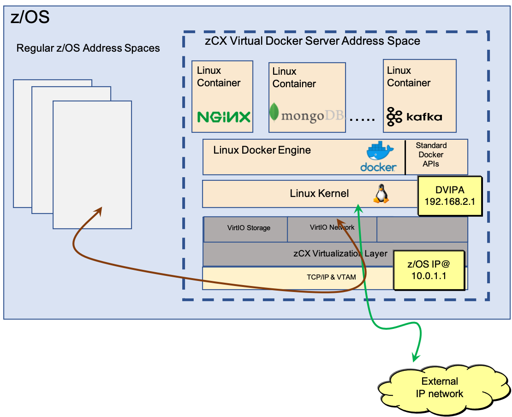

Most of you are probably already familiar with the power of container technology on Linux. Deploying 
containers allows for better application isolation, improved developer productivity by simplifying the 
configuration and startup of test environments, and better code quality because the container environment 
that is used for testing the application will be the same environment used for production. This technology 
is now available on z/OS with Containers Extensions, or zCX. 

In a prior Hot Topics article, [Rapid Containers: Improving zCX Runtime Performance](https://ibm.com/support/z-content-solutions/hot-topics/2020/rapid-containers-improving-zcx-runtime-performance), 
you learned how the hardware page frame size used can impact the performance of your zCX runtime.  
In this article, you will learn how to optimize the network communication to and from your zCX instance. 

## zCX Networking

Let’s first examine how zCX leverages the existing z/OS TCP/IP networking stack. Because zCX takes 
advantage of the virtio Linux interfaces, the Linux network that is used by zCX can be virtualized 
such that it can access the existing network interfaces managed and provided by z/OS.  

Each provisioned zCX address space is assigned its own dynamic virtual IP address (VIPA) that is 
managed and advertised by z/OS TCP/IP stack. Access to any Docker container running within a zCX 
instance is accomplished by using this dynamic VIPA. The dynamic VIPA in the example in Figure 1 
is 192.168.2.1. Because zCX uses a dynamic VIPA, if the z/OS system fails, the zCX instance can be 
restarted on any other z/OS system in the sysplex, providing a highly available container environment.

All communication between a Docker container running in zCX and an external endpoint occurs over the z/OS 
TCP/IP stack. There are two network types that are used for communicating with Docker containers. 
For endpoints that are colocated in the same z/OS system as the container running in zCX, a high 
speed, cross-memory virtual network is used for communication, indicated by the brown arrow in Figure 1.  
For an endpoint that resides on a different z/OS system or different platform altogether, an external 
network interface is selected, shown by the green arrow in Figure 1. This selection is based on what the 
best available route to this endpoint is from the z/OS TCP/IP stack’s perspective – in Figure 1, this 
route is over the network interface with IP address 10.0.1.1.

## zCX Co-location

When considering whether to take advantage of the Linux Docker container environment provided by 
zCX for your application tier, you should aim to keep the container colocated with the z/OS database 
management system (DBMS), if possible. 

As shown in Figure 2, by leveraging the cross-memory virtual network for zCX, you can reduce the 
overall network latency between the application and data tiers that can negatively impact the 
response times for your transactions. Comparing a containerized application tier on zCX colocated 
with the data tier versus a containerized application tier deployed on a different system from the 
data tier, benchmarking shows that network latency reductions of 50% or more is possible. Colocation 
of the application and data tiers can have a dramatic improvement on transaction rates for OLTP workloads. 

For scenarios where there are large transaction payloads between the application and data tiers, 
an additional step can be performed to provide even more optimizations in a colocated zCX environment. 
Because the cross-memory virtual network is used for communication when zCX instances are colocated with 
their endpoints, there is no physical limit imposed on the size of a packet that can flow over this network. 
By configuring a larger MTU for zCX when deploying a zCX instance, the amount of processing to segment 
and transmit the larger payloads is reduced. This method translates into reduced CPU utilization and 
substantial improvements in the throughput can be achieved.

## zCX External Communication

There can be scenarios or conditions where a Docker container running in zCX cannot be colocated with 
the z/OS data tier. In these scenarios, optimizations can still be made to make the communication over 
the external network as efficient as possible. 

Inbound Workload Queueing, or IWQ, is an OSA Express feature that allows inbound packets to be separated 
based on workload traffic type. A new enhancement to enable IWQ for zCX workloads is available with TCP/IP 
apar PH16581 and VTAM apar OA58300.  

When configuring IWQ and using zCX, as shown in Figure 3, any inbound packets destined to a Docker 
container in zCX would be separated from packets targeting other applications running on z/OS. This 
separation helps to preserve the ordering of packets being delivered to zCX, thus reducing unnecessary 
retransmits whenever any packets arrive out of order. This traffic separation also enables the z/OS 
processing of these inbound zCX packets to be scheduled to run on zIIPs.

Comparing environments with and without IWQ configured, benchmarking shows that network latency 
reductions of 25% or more can be achieved. And with IWQ enabled for workloads using zCX, benchmarking 
results confirmed that over one-third of this networking processing can be scheduled to run on zIIPs. 

## Summary

zCX is an exciting new capability for running workloads in a z/OS environment. Network communication 
is an important piece to get right. When deploying zCX instances, where the zCX instance for the 
application is deployed in relation to the backend z/OS DBMS the application accesses must be considered. 
Likewise, taking advantage of the latest z/OS Communications Server enhancements to enable IWQ for zCX 
workloads can result in significant improvements in transaction rates and a reduction in processing costs 
on general-purpose CPs to run these workloads.

## About the author

Mike Fitzpatrick is an architect with the z/OS Communications Server group, focusing on resiliency and networking performance.
